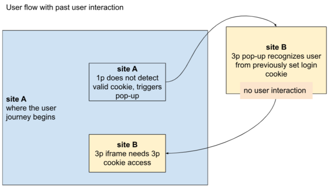
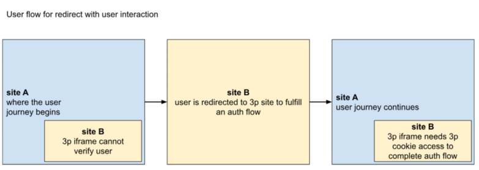

# Cookie Access Heuristics Explainer

Authors: Anton Maliev, Ben Kelly, Helen Cho

TODO: inline links, images

# Introduction
While browsers are actively working to remove support for third-party cookies, it is also clear that there will be unintended impacts to user experience on the web. Several proposals that intend to mitigate user-facing breakage are being discussed in web standards forums, but they may not be sufficient to avoid site breakage (in particular, those involving authentication flows). In some cases, the proposals currently address a limited scope of scenarios. In other cases, adoption of these proposals require more time and bandwidth than sites may have at their disposal. 

There are established practices in the ecosystem where temporary third-party cookie access is granted in a predefined flow (one in which the user interacts with the third-party site as a baseline). These practices help mitigate site breakage caused by third-party cookie deprecation. This explainer examines use cases that benefit from this practice and examines existing mitigations in the ecosystem that follow a heuristics-based pattern of allowing 3p cookie access in limited scenarios. Finally, this explainer identifies potential security and privacy concerns with these approaches, and proposes behaviors to prototype which could strike the right balance between web compatibility efforts and security/privacy goals.

# Goals
*   Evaluate existing browser mitigations that bypass third-party cookie deprecation for certain behaviors. Review potential privacy and security concerns for adopting these broadly.
*   Minimize user-facing breakage in a scaled manner by introducing a proactive solution that requires no incremental work from developers. Over time, encourage developers to adopt long-term APIs and reduce reliance on the heuristics. See more in [open questions](#open-questions).
*   Prototype a solution that targets clear use cases in the ecosystem, which would be broken in a user-visible way due to the rollout of third-party cookie deprecation.
*   Avoid a solution that is too lenient or able to be manipulated, such that a malicious third-party can easily abuse the solution to track users across sites in a widespread manner or use heuristics to reveal new information about users.

# Non-goals
*   This proposal does not introduce a new API that site developers need to write to in order to enable cookie access. The purpose is to preserve existing behavior by providing exemptions automatically within the browser.
*   This proposal does not aim to identify and fix every single use case we observe to be broken. Tailoring heuristics to match isolated use cases is not scalable, can be prone to bias, and also increases the risk of opening a workaround for illegitimate actors.

# Key Use Cases
The following use cases describe user flows identified by browser vendors as requiring 3p cookie access via heuristics to fulfill a critical user journey (such as authentication) on the web. Developers of new or updated sites may redesign any of these use cases to utilize Storage Access API and avoid breakage.

## Use Case 1a: Popup with Current Interaction
A user visits site A, which opens a login flow in a popup that is hosted on a different site B. The user interacts with the pop-up to authenticate, and the pop-up is closed to return focus to site A.

In this scenario, site B needs to be able to access its cookies on site A following the user’s interaction with the popup window, to verify the authentication.

We have observed this flow on sites such as [nintendo.de](nintendo.de), which opens a popup to cross-site [accounts.nintendo.com](accounts.nintendo.com) to sign users in (see [description of use case](https://issuetracker.google.com/268390722)).

## Use Case 1b: Popup with Past Interaction 
Following a similar flow with a pop-up to site B triggered from site A, if the user has interacted recently with site B, such that site B has a valid login cookie, then the user may not need to go through the login flow again in the pop-up. User interaction in the pop-up is not strictly necessary for the 3p to authenticate the user.

If 3p cookie access has not already been granted from a prior pop-up flow or the access has expired, site B will need 3p cookie access on site A to verify the authentication.

We have observed this flow on sites such as [docs.google.com](docs.google.com), which offers a client-side encryption feature that can be managed by a third-party identity provider (see [description of use case](https://issuetracker.google.com/issues/274778613)).

## Use Case 2: Redirect with Interaction
A user visits site A, and is directed to sign in with an Identity Provider (IdP) on site B. They are then redirected back to site A. The IdP reads the auth cookie on site A, as a third-party, and provides the auth signal back to A.

In this scenario, site B needs access to 3p cookies on site A following the user’s interaction with its site as the previous page in the redirect chain.

We have observed this flow on sites such as [pixnet.net](pixnet.net) (see [description of use case](https://issuetracker.google.com/281701307)). 

# Examples of Heuristics in the Ecosystem
Other browsers have shipped logic to handle certain scenarios, based on behaviors abstracted from the [Key Use Cases](#key-use-cases) described above. When a scenario is detected, the browser creates a cookie access grant between the third-party site and the relevant first-party site.

This section describes the state of the field, as a means to examine [Privacy and Security Considerations](#privacy-and-security-considerations) of existing approaches. This section does not represent any explicit proposal for Chrome to implement the stated heuristics. For a summary of the implementation proposed by this explainer, see the “[Proposal to Prototype](#proposal-to-prototype)” section below.

Constants that may be implementation-defined are represented by variables - more discussion on these is located under [Privacy and Security Considerations](#privacy-and-security-considerations) below.

## Scenarios

### Scenario A
1. A resource is loaded in a pop-up window with opener access, possibly following a set of HTTP redirects*.
2. The resource receives a user interaction after being loaded. 
3. In this case, the first-party site is the opener document and the third-party site is the loaded resource.

*Note: If there is a set of HTTP redirects in the pop-up window (like the Nintendo example), user interaction in the pop-up will be required after the redirects, to ensure the user is interacting with the 3p that will be granted 3p cookie access.

This scenario has been used by [Firefox](https://developer.mozilla.org/en-US/docs/Web/Privacy/Storage_Access_Policy#automatic_storage_access_upon_interaction) and [Safari](https://webkit.org/blog/8311/intelligent-tracking-prevention-2-0/#:~:text=Temporary%20Compatibility%20Fix%3A%20Automatic%20Storage%20Access%20for%20Popups) to grant temporary storage access.

### Scenario B
1. A site is loaded in a pop-up window with opener access.
2. The same site has received a user interaction within the past X days.
3. In this case, the first-party site is the opener document and the third-party site is the loaded resource.

This scenario has been used by [Firefox](https://developer.mozilla.org/en-US/docs/Web/Privacy/Storage_Access_Policy#automatic_storage_access_upon_interaction) and [Safari](https://webkit.org/blog/8311/intelligent-tracking-prevention-2-0/#:~:text=Temporary%20Compatibility%20Fix%3A%20Automatic%20Storage%20Access%20for%20Popups) to grant temporary storage access.

### Scenario C
1. Site B redirects to Site A (possibly through other origins). 
2. Site B has received a user interaction within the past X days. 
3. In this case, the first-party site is Site A and the third-party site is Site B.

This scenario has been used by [Firefox](https://developer.mozilla.org/en-US/docs/Web/Privacy/Storage_Access_Policy#automatic_storage_access_upon_interaction) to grant temporary storage access.

# Privacy and Security Considerations

## Evaluating the existing approaches
The example heuristics above describe scenarios in which the browser automatically grants third-party cookie access based on certain confidence signals. These confidence signals are largely pattern-based and rely on user interaction requirements. User interaction is certainly a way to interpret user awareness and intent, but is not a guarantee. From this perspective, there is an element of privacy risk in a heuristics-based approach. As identified in the [Goals](#goals) section, reducing widespread reliance on heuristics over time may be a way to minimize privacy risk in the long-term, while mitigating user-facing breakage in the short-term.

### Risks of third-party cookie access
There are security considerations to keep in mind when allowing 3p cookie access, which have been articulated in [Standardizing Security Semantics of Cross-Site Cookies
](https://github.com/DCtheTall/standardizing-cross-site-cookie-semantics) and [Improving the Storage Access API security model](https://docs.google.com/document/d/1AsrETl-7XvnZNbG81Zy9BcZfKbqACQYBSrjM3VsIpjY/edit#heading=h.vb3ujl8dnk4q). The Storage Access API addressed these concerns through a number of changes, in particular by removing “implicit” 3P cookies and instead [requiring a per-frame opt-in](https://github.com/privacycg/storage-access/issues/122) through the use of the API. Because browser-led mitigations seek to minimize developer effort in updating sites affected by the removal of 3P cookies, they are limited in providing the same improved security properties. 

The core security consideration for this proposal stems from the fact that malicious sites may be able to abuse legitimate functionality on unrelated victim sites to trigger the heuristic to regain cookies in third-party contexts. This concern is particularly prominent for heuristics which grant access to cookies based on past user interaction with the victim site because they allow the attacker to trigger the heuristic without an additional user action.

If an attacker is capable of triggering the heuristic for a victim domain, they may abuse this access in two ways:
1. Use the ability to send credentialed requests to the victim site to exploit a number of common cross-site vulnerabilities prevented by third-party cookie deprecation discussed in the [Improving the SAA security model](https://docs.google.com/document/d/1AsrETl-7XvnZNbG81Zy9BcZfKbqACQYBSrjM3VsIpjY/edit#heading=h.vb3ujl8dnk4q) document, including clickjacking and XS-Leaks.
2. Learn that the user has recently interacted with the victim site, leaking information about the user's past browsing activity.

The first risk is particularly concerning in a post-third-party cookie world where most cross-site attacks will be mitigated by limiting the ability to send cross-site resource requests with cookies. There is a tangible risk of developers no longer protecting against these attacks once third-party cookies are blocked in all major browsers. The ability to force the heuristic to trigger for a victim site would undermine these platform protections.

This proposal intends to prevent these attacks or make them sufficiently impractical. Due to the way that these heuristics restore access to third-party cookies, there is still likely to be a tradeoff between some risks vs. web compatibility benefits, which we want to explore and discuss with the web community.

### Force-triggering heuristics for a third party site
The ability for a top-level site to perform any kind of attack using the cookie access granted to a 3rd-party embed is contingent on that top-level site’s ability to trigger the heuristics without the cooperation of the 3rd party. None of the outlined examples give the 3rd party explicit control over heuristics (as the heuristics intend to function without requiring changes to websites), but some will require either one or two instances of user interaction to trigger, increasing the friction for an attacker.

It should be considered whether more explicit controls over the heuristics are needed, at least as an opt-out functionality.

## Implementation options to mitigate risk

### Scope of cookie access
The cookie access grant applies only to the pair of first-party site and third-party site. For instance, if a scenario is met with first-party-site a.com and third-party site b.com, then any domain on b.com is allowed to access cookies when loaded as a resource or iframe on any domain on a.com. This grant does not apply to other third-party sites under a.com, nor does it apply to b.com as a third-party resource of another top-level domain. Additionally, cookie access should not be granted to resources of b.com embedded by other iframes which are cross-site to b.com.

Notably, this cookie access grant immediately enables resources and embedded documents with the site b.com to access third-party cookies, unlike the Storage Access permission which requires an explicit invocation of document.requestStorageAccess by an embedded iframe to activate third-party cookie access.

#### Limitations
This is a partial mitigation for the security concerns articulated above, as the cookie access grant would only apply to first-level embeds (i.e. resources directly embedded by the top-level document) or their nested same-site embeds. This prevents attacks from untrusted 3P embeds, but does not prevent an attack by the top-level document. This allows a malicious first party to trigger these heuristics by navigating to arbitrary target domains on the third-party site. Re-enabling third-party cookies in this case would allow the first party to abuse credentialed requests made by the third party on the first party page.

For instance, consider evil.com attempting to obtain credentialed access to bank.com. It can unilaterally abuse Scenario B by opening a popup to an arbitrary domain on bank.com. Provided the user has accessed bank.com at any time in the last 30 days, this will satisfy Scenario B and grant a cookie access to bank.com when it is embedded on evil.com. Then when bank.com makes a credentialed request on evil.com, it exposes itself to attacks of the sort described in [Improving the Storage Access API security model](https://docs.google.com/document/d/1AsrETl-7XvnZNbG81Zy9BcZfKbqACQYBSrjM3VsIpjY/edit#heading=h.vb3ujl8dnk4q).

### User signals and preferences
User agents should offer their users the possibility to opt out of these heuristics, noting the potential web breakage that could result from this decision. This could come in the form of differentiating between “default” protection against third-party cookies vs. full “third-party cookie blocking”, which disables heuristics and other web compatibility measures, as it is done in Firefox.

All three examples require some kind of user interaction. Interpreting how the user knows and intends to interact with the 3p is critical in ensuring that 3p cookie access is only granted in limited situations that serve a critical user journey. Mandatory user visibility and participation also increases the friction and effort for attackers to a great degree.

#### Limitations
While the user interaction requirement provides a signal to the browser of user intent and awareness of the third-party, it may also leak the presence of a user interaction on the target domain. In the example where evil.com is triggers the heuristic for bank.com, evil.com can detect whether cookies from bank.com are present in a third-party context, and use that to infer that the user has had an interaction on bank.com in the last 30 days. This adds a new information that doesn’t currently exist in the web platform.

### Duration of cookie access
As implemented by [Firefox](https://developer.mozilla.org/en-US/docs/Web/Privacy/Storage_Access_Policy#automatic_storage_access_upon_interaction), the grant for Scenarios A and B persists for 30 days - these scenarios permit a long-term access that persists across user sessions (e.g. a persistent authentication token). The grant for Scenario C (as implemented by [Firefox](https://developer.mozilla.org/en-US/docs/Web/Privacy/Storage_Access_Policy#automatic_storage_access_upon_interaction)) persists for 15 minutes - this scenario permits a short-term access that should only last for the current user session (e.g. a single cookie access).

The grants for Scenarios A and B appear consistent with other implementations of third-party cookie access (like permissions granted through the Storage Access API). Since these are browser-led heuristics, we invite feedback on whether these grant durations appropriately minimize user-facing breakage while staying within privacy and security constraints.

In general, we welcome any additional insight into privacy and security considerations that have not been identified in this explainer.

# Proposal to Prototype
In an effort to begin with a limited scope of browser-led heuristics (given the [Privacy and Security Considerations](#privacy-and-security-considerations) articulated above), we propose experimenting with two key scenarios, with the explicit goal of further examining the privacy and security implications through experimentation and to address the [Open Questions](#open-questions) listed below.

1. Scenario A (Popup with Current Interaction) as currently implemented by Firefox and Safari. 
Experiment with variable storage access grant duration from 5 days to 60 days.
2. A modified Scenario C, detailed below as Scenario C2:

### Scenario C2
1. User begins on Site A, and is then redirected to Site B.
2. Site B receives a user interaction.
3. Site B then redirects back to Site A (possibly through other origins).
4. In this case, the first-party site is Site A and the third-party site is Site B.

This adds the requirement that the user starts on Site A, which narrows the use cases from all single redirects to flows where the user passes through Site B while interacting mostly with Site A. This also adds the requirement that the user interaction happens during this redirect, not at any point within the last 30 days. These restrictions still include the [pixnet.net](pixnet.net) example observed in the [motivating issue](https://issuetracker.google.com/281701307), but limit the security risks.

Due to the outlined privacy and security concerns, we currently do not propose solving for scenarios B and C, as these two scenarios both rely on prior interactions rather than current interactions, and thus are more vulnerable to both credentialed request attacks and user history leaks.

# Open Questions
1. How often do Scenarios A, B, C and C2 occur on the web for the average user? 
    * How does not supporting Scenarios B and C impact the user-facing experience?
2. How long should the storage access grant last for each scenario? 
    * How does variation in the grant impact the user-facing experience?
3. How else could we modify the heuristics to balance mitigating site breakage and minimizing privacy/security risks?
4. As we examine how to ramp down reliance on browser-managed heuristics for sites to function, we welcome feedback on how to encourage the ecosystem to rely less on heuristics (e.g., shortening permission duration).

# Stakeholder Feedback / Opposition
TBD - This proposal is pending feedback from the appropriate WGs.

# References & acknowledgements
Safari has implemented the [pop-up heuristic](https://webkit.org/blog/8311/intelligent-tracking-prevention-2-0/#:~:text=Temporary%20Compatibility%20Fix%3A%20Automatic%20Storage%20Access%20for%20Popups).

Firefox has implemented both the pop-up heuristic and the redirect heuristic, as detailed in their [Storage access policy explainer](https://developer.mozilla.org/en-US/docs/Web/Privacy/Storage_Access_Policy#automatic_storage_access_upon_interaction).

We want to acknowledge and thank the other browser vendors for all the work they have done on this topic.

Thank you for design input, feedback, and review from:
* Johann Hofmann
* Ryan Tarpine
* Artur Janc
* Christian Dullweber
